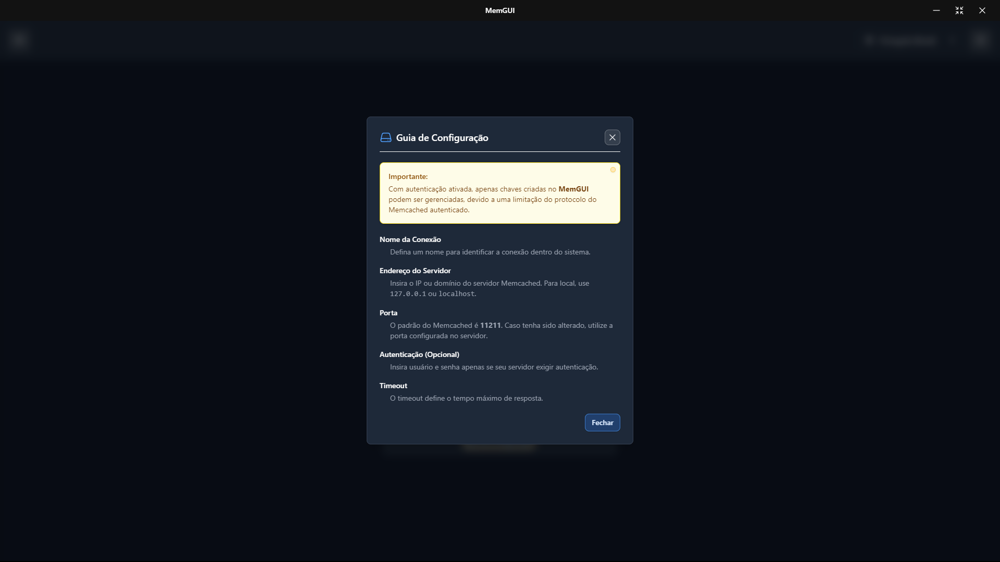
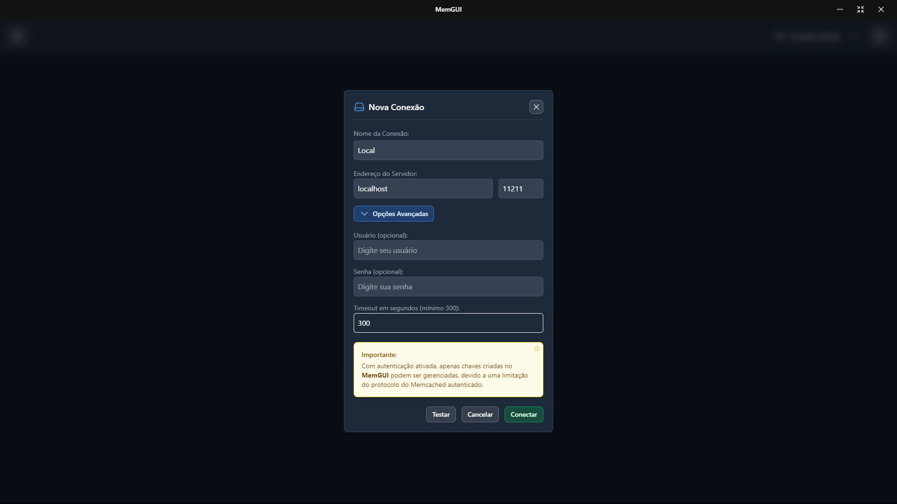
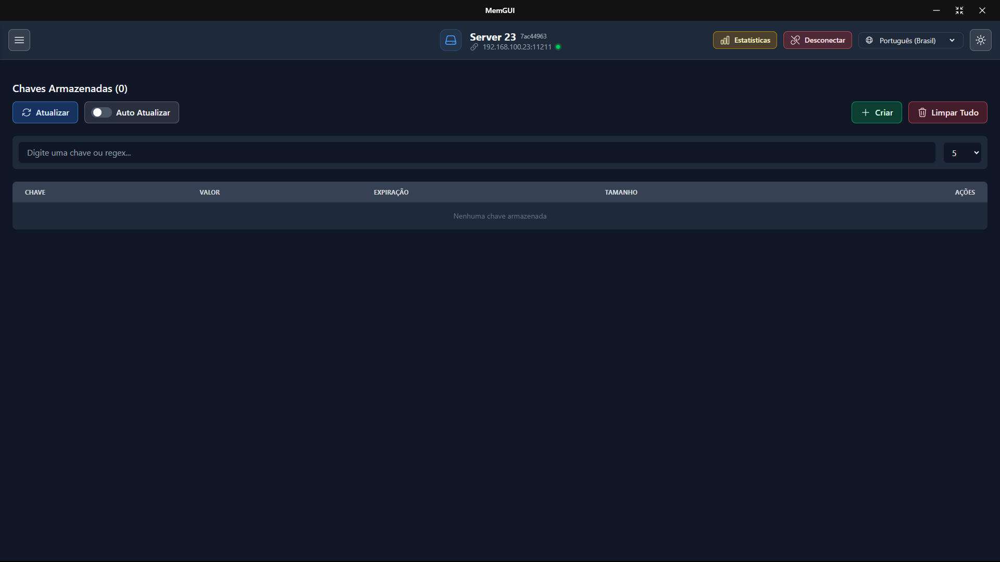
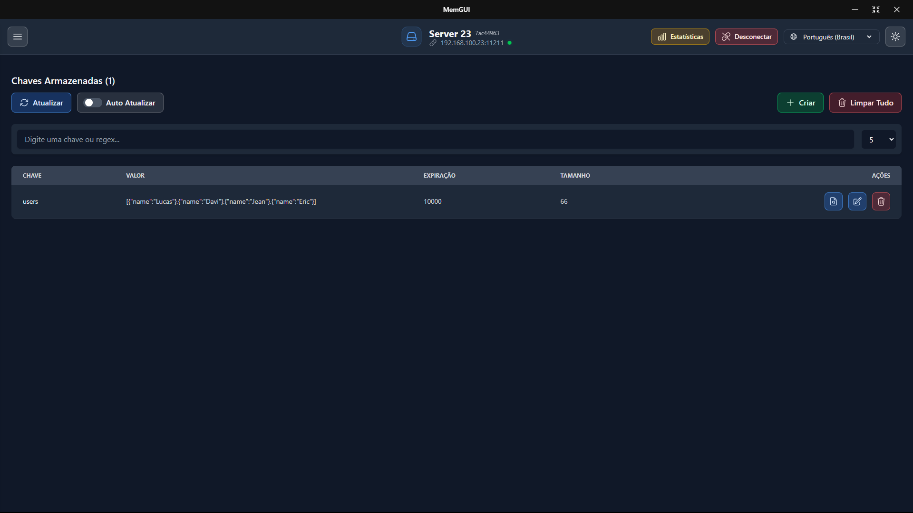
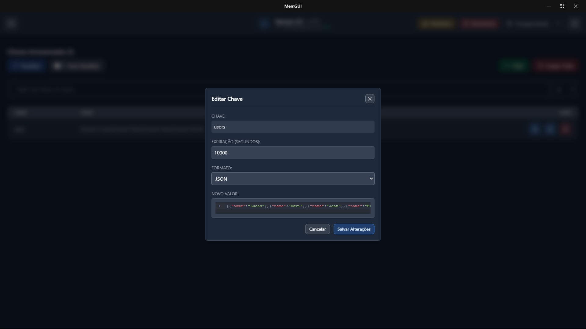

# MemGUI

  

**MemGUI** is a modern, intuitive GUI for **Memcached**—perfect for anyone wanting to visualize, monitor, and manage cached data without wrestling with the command line. Whether you're handling a single Memcached instance or multiple servers at once, MemGUI keeps your workflow fast and simple.

---

## Why MemGUI?

- **Visual key management**: Create, edit (text or JSON), delete, and inspect keys in real time.
- **Bulk actions with safety**: Delete all keys from the current server with confirmations to avoid mistakes.
- **Auto-refresh + server key count**: Keep listings fresh automatically and see how many keys are stored at a glance.
- **Optimized search**: Server-side filtering (regex or plain text) for faster, accurate results on large datasets.
- **Multi-server & connection editing**: Switch between servers quickly and edit connection details directly from the list.
- **Update notices**: Get in-app notifications for updates and auto-update availability on desktop builds.
- **SASL authentication**: Connect securely with username/password when required.
- **In-depth stats**: Uptime, memory usage, cache hits, slab details, and more.
- **Guided onboarding + themes**: Optional setup guide, plus light and dark themes.

---

## Installation

To start using **MemGUI**, visit our [Releases page](https://github.com/lucassm02/mem-gui/releases). Two download options are provided:

1. **Portable (Unpacked)**

   - No installation required. Just unzip and run the executable.

2. **Setup (Installer)**
   - A guided installation wizard that walks you through setup on your system.

Pick the format you prefer and launch **MemGUI** to begin managing your Memcached servers!

---

## Screenshots

---

## Internationalization

- Languages available: Portuguese (Brazil), English, Spanish, French, German, Chinese (Simplified), Japanese, Korean, and Arabic. The UI picks your browser/OS locale and keeps your choice pinned to the selector.
- A language selector is always visible in the top bar (both connected and disconnected states), and preferences persist automatically.

**Adding a new language**
1. Copy an existing locale file (e.g., `src/ui/i18n/locales/pt-BR.json`) to `src/ui/i18n/locales/<language>.json` and translate the values.
2. Add the new language code to `supportedLanguages` in `src/ui/i18n/index.ts`.
3. In every locale file, include a label for the new code inside the `language` section so it appears correctly in the selector.

---

## Contributing

While **MemGUI** is licensed for **non-commercial use**, we welcome feedback and collaboration! Feel free to [open an issue](https://github.com/lucassm02/mem-gui/issues) or submit a pull request if you spot improvements, bugs, or have feature requests.

---

## License

This project is licensed under the **Non-Commercial Use Only License**. You are granted a limited, non-exclusive, and non-transferable license to use this software for personal, educational, or non-commercial research purposes only. Commercial use—including selling, offering paid services, or integrating this software into commercial products—is strictly prohibited. For the full details, please see the [LICENSE](LICENSE) file.
