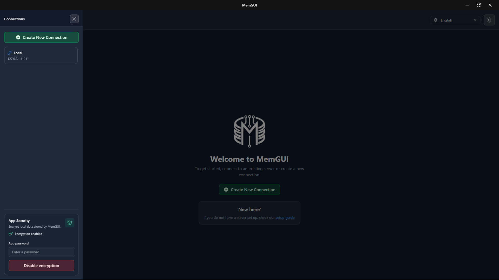
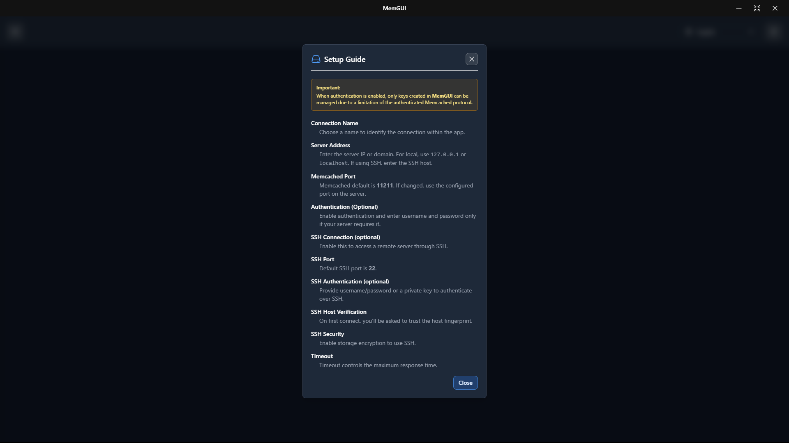
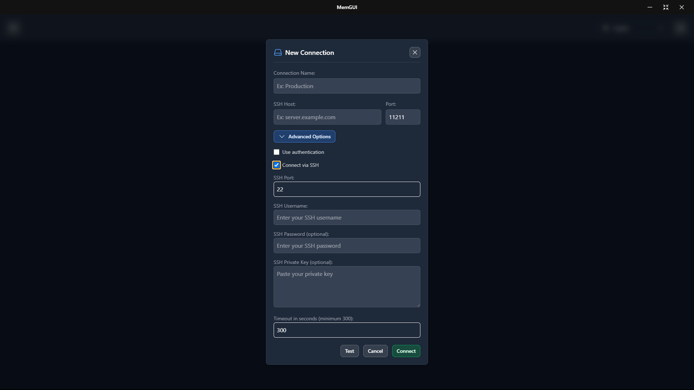
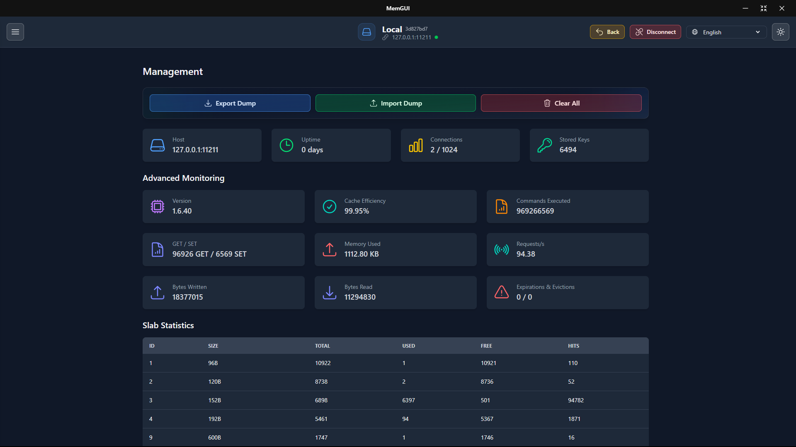
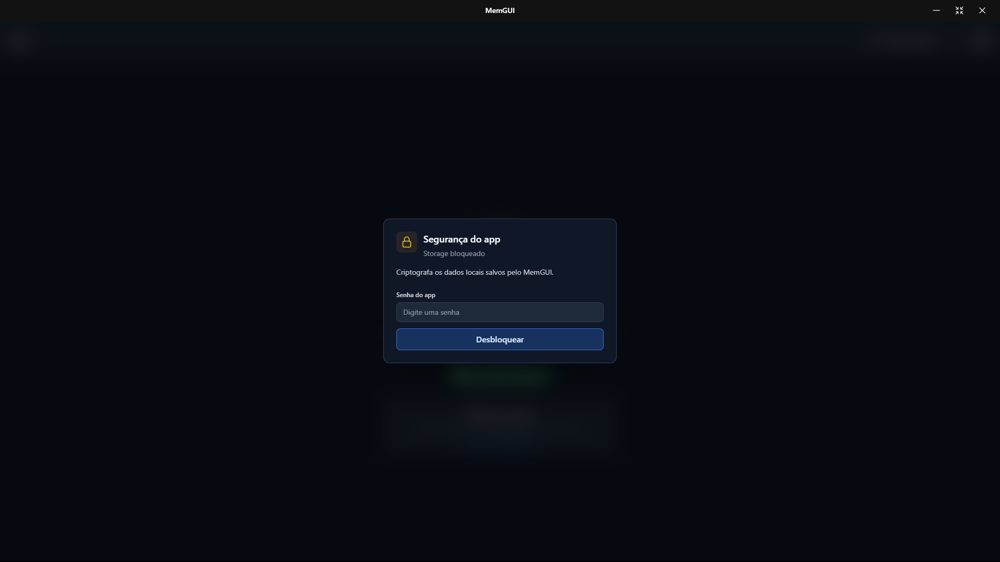
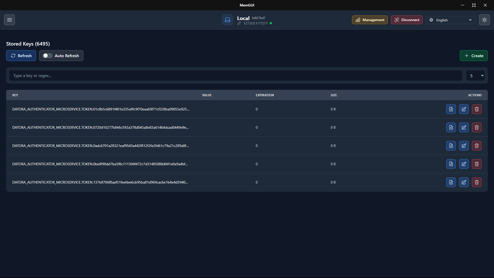
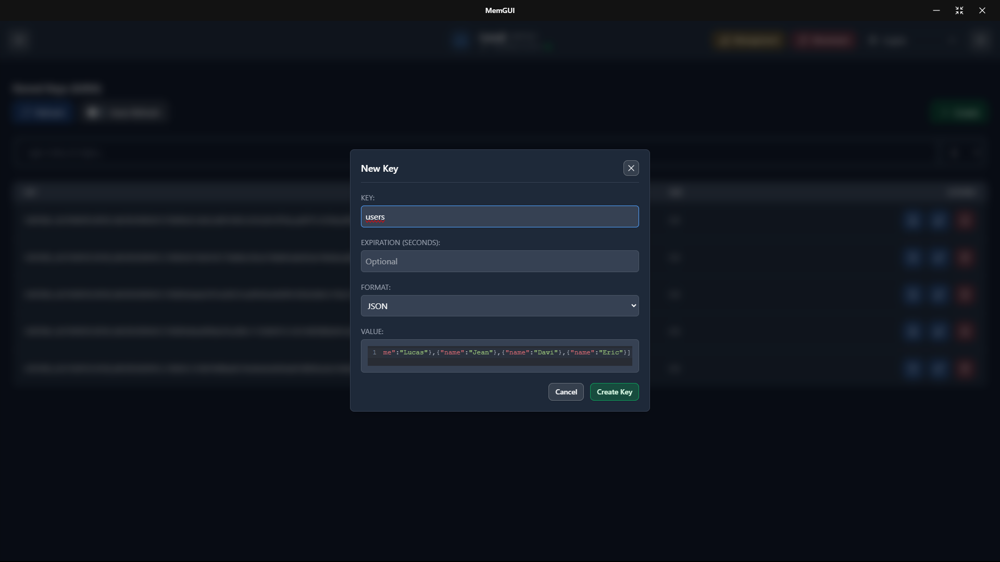
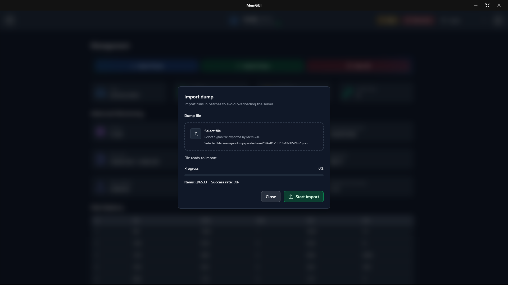
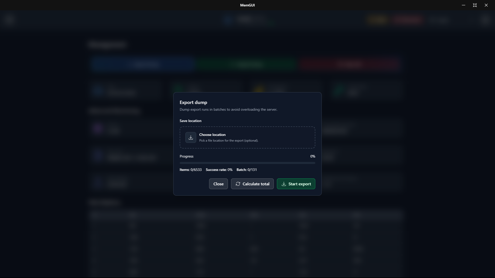

# MemGUI Usage Guide

MemGUI is a Memcached GUI client and desktop app for managing cached data with a fast, visual workflow.

## Features

- Memcached key management (create, edit JSON or text, delete, inspect)
- Dump import/export for backup and migration
- SSH connections with host key verification (v1.2.0)
- Storage encryption for local data and SSH secrets (v1.2.0)
- Bulk delete with confirmation for safe cleanup
- Server-side key search with regex or plain text filters
- Faster key indexing with stale key pruning
- Multi-server connections with inline editing and quick switching
- SASL authentication for secured Memcached instances
- Auto-refresh with live key counts
- Server statistics (uptime, memory, cache hits, slabs)
- Update notices and auto-update availability for desktop builds
- Multi-language UI with a persistent language selector

Note: SSH connections, storage encryption, and dump import/export are available in v1.2.0 (pre-release).

## Install and Launch

1. Download the latest build from <https://github.com/lucassm02/memgui/releases>
2. Choose portable (unpacked) or installer
3. Launch MemGUI and add your Memcached connection

## Connect to a Memcached Server

- Open the connection manager and add a new server.
- Enter host and port.
- If required, enable SASL and provide username and password.
- Save and connect.

## SSH Connections (v1.2.0)

- Enable "Connect via SSH" in the connection form.
- Enter the SSH host, port (default 22), and username.
- Provide an SSH password or private key.
- Confirm the host fingerprint when prompted.
- Enable storage encryption to save SSH secrets.

## Storage Encryption (v1.2.0)

- Open the Storage Security panel in the connections screen.
- Enable encryption and set a password to protect local data.
- Unlock storage when prompted to access saved connections and SSH secrets.

## Manage Keys

- Create a key with text or JSON value.
- Open a key to inspect value and metadata.
- Edit keys inline and save changes.
- Delete keys individually when needed.

## Import and Export (Dump) (v1.2.0)

- In the key list, choose Export Dump to back up keys.
- Export runs in batches to avoid server overload.
- Use Import Dump to restore keys from a JSON dump file.

## Search and Filter

- Use the search bar to filter keys.
- Switch between plain text and regex depending on your workflow.
- Backend search keeps results consistent on large datasets.
- Index updates and stale key pruning keep lookups fast.

## Bulk Delete

- Use the bulk delete action to remove all keys on the current server.
- Confirm the action to avoid accidental removal.

## Server Statistics

- Open the stats view to monitor uptime, memory usage, and cache hit rate.
- Use the details view for slab and allocation metrics.

## Multi-Server Workflow

- Keep multiple connections saved.
- Switch between servers without losing your place.
- Edit connection settings directly from the list.

## Updates and Notices

- Desktop builds surface update notices inside the UI.
- Auto-update availability is shown when a new release is ready.
- Pre-release builds (like v1.2.0) are listed on GitHub Releases.

## Language and Localization

- Use the language selector to switch UI language.
- The app remembers your last choice and restores it on launch.
- Available languages: Portuguese (Brazil), English, Spanish, French, German, Chinese (Simplified), Japanese, Korean, and Arabic.

## Adding a New Language

1. Copy an existing locale file (for example, `src/ui/i18n/locales/pt-BR.json`) to `src/ui/i18n/locales/<language>.json` and translate the values.
2. Add the new language code to `supportedLanguages` in `src/ui/i18n/index.ts`.
3. In every locale file, include a label for the new code inside the `language` section so it appears correctly in the selector.

## Screenshots

